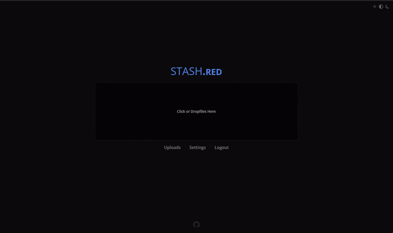

> stash.red is a Small footprint File host (Specificly for Image/Video and Audio files)


---



---

## Table of Contents
- [Prerequisites](#prerequisites)
- [Installation](#installation)
- [Features](#features)
- [License](#license)

---

# Prerequisites
### NOTE: all instructions will assume you are using Debain, Cloudflare, Sqlite3 and File Storage

- A server to host the code
- A Domain name (recommended registrar: [Cloudflare](https://www.cloudflare.com/products/registrar/))
- A Reverse Proxy capable Webserver (reccomended: [Nginx](https://www.nginx.com/))
- Node LTS `Tested on versions 18.18.2 and 20.9.0` (recommended: use [Node Version Manager](https://github.com/nvm-sh/nvm#installation-and-update))
- Git
  ```bash
  $ sudo apt install git
  ```
- Essential Build tools
  ```bash
  $ sudo apt install build-essential
  ```

#### Optional Highly Reccomended
- [PM2](https://pm2.keymetrics.io/)

---

# Installation
> *It is Recommended to begin in your Home directory (`cd ~`)*

#### Clone
- Clone this repository using
  ```bash
  $ git clone https://github.com/cmd430/stash.red yourdomainname.tld
  ```

#### Setup
- Change into the newly created directory and install dependencies
  ```bash
  $ cd yourdomainname.tld
  $ npm i --omit=dev
  ```
- Copy `./config/sql/002-Config.template` to `./config/sql/002-Config.sql`
- Edit any options in `./config/sql/002-Config.sql`
  > note: it is reccomended to only change settings tagged with: `<CHANGE_ME:setting_explaination>` unless you know what you are doing
  ```bash
  $ nano ./config/sql/002-Config.sql
  ```

##### If using PM2
- Start with PM2 and run continuously
  ```bash
  $ pm2 start ecosystem.config.js
  ```

##### If *not* using PM2 (**NOT** reccomended)
- Start the server
  ```bash
  $ node main
  # or
  $ npm run start
  ```

#### Configure Reverse Proxy (Nginx)
- Create site config
  ```bash
  $ sudo nano /etc/nginx/sites-available/yourdomainname.tld
  ```
  - add the following config (change where necessary) and save
    ```nginx
    server {
      server_name <yourdomainname.tld>;

      listen 443 ssl;
      ssl_certificate <path_to_cloudflare_origin_certificate>/origin-cert.pem;
      ssl_certificate_key <path_to_cloudflare_origin_private_key>/private-key.pem;

      location / {
        proxy_pass http://localhost:3000;
        proxy_http_version 1.1;
        proxy_set_header X-Forwarded-Proto https;
        proxy_set_header Upgrade $http_upgrade;
        proxy_set_header Connection 'upgrade';
        proxy_set_header Host $host;
        proxy_cache_bypass $http_upgrade;
        proxy_request_buffering off;
      }
      client_max_body_size 0;
    }
    ```
- Create a symbolic link in `../sites-enabled/` and reload nginx
  ```bash
  $ sudo ln -s /etc/nginx/sites-available/yourdomainname.tld /etc/nginx/sites-enabled/yourdomainname.tld
  $ sudo nginx -s reload
  ```

#### Testing
If everything is working correctly you should be able to open `https://yourdomainname.tld` in your browser

---

# Features
- Account creation with hashed and salted passwords and captcha
- Private uploads (hidden unless you have the link)
- Simple Album and Single file support
- User pages to see files uploaded by specific users
- Ability to easily find content by User or by Album
- Zero loss in quality of uploaded files

---

# License
THE SOFTWARE IS PROVIDED "AS IS", WITHOUT WARRANTY OF ANY KIND, EXPRESS OR IMPLIED, INCLUDING BUT NOT LIMITED TO THE WARRANTIES OF MERCHANTABILITY, FITNESS FOR A PARTICULAR PURPOSE AND NONINFRINGEMENT. IN NO EVENT SHALL THE AUTHORS OR COPYRIGHT HOLDERS BE LIABLE FOR ANY CLAIM, DAMAGES OR OTHER LIABILITY, WHETHER IN AN ACTION OF CONTRACT, TORT OR OTHERWISE, ARISING FROM, OUT OF OR IN CONNECTION WITH THE SOFTWARE OR THE USE OR OTHER DEALINGS IN THE SOFTWARE.

[Full MIT License](LICENSE.md)
