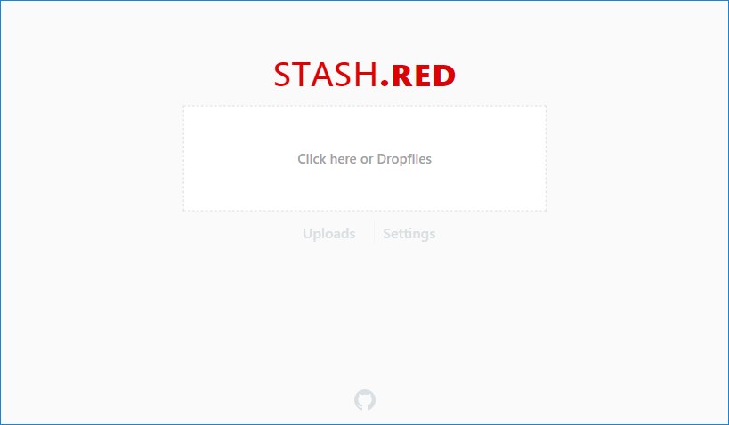

# 

stash.red is a Small footprint File host (Specificly for Image/Video and Audio files) It contains:
 - Account creation with hashed and salted passwords
 - Private uploads (hidden unless you have the link)
 - Simple Album and Single file support
 - User pages to see files uploaded by specific users
 - Ability to easily find content by User or by Album
 - Zero loss in quality of uploaded files

 
> Screenshot of Home/Upload page

Installation (Basic)
============
1. Install MongoDB (version `4.0+`)
2. Install NodeJS (version `10+`)
3. Clone the repository with: `git clone https://github.com/cmd430/stash.red.git`
4. Install dependencies `npm install --only=prod`
5. Start the server with `node server` or `npm run server`

Installation (Advanced)
============
 - TODO

### **Notes** 
 -  `mongod` will be automatically started as a child process
 - special directories will be created if missing
 - many settings can be changed in the `config.js` file

Documentation
============
 - TODO