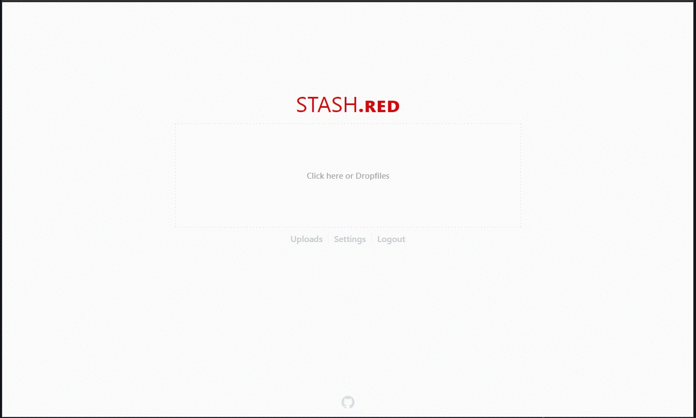

> stash.red is a Small footprint File host (Specificly for Image/Video and Audio files)


---

 

---

## Table of Contents
- [Prerequisites](#prerequisites)
- [Installation](#installation)
- [Features](#features)
- [License](#license)

---

# Prerequisites
- Debain/Ubuntu Linux (*or any other POSIX compliant system however these are untested*)
- A Domain name (recommended registrar: [Namecheap](https://www.namecheap.com/))
- A Reverse Proxy capable Webserver (reccomended: [Nginx](https://www.nginx.com/))
- Node `version >= 10 < 12` (recommended: use [Node Version Manager](https://github.com/nvm-sh/nvm#installation-and-update))
- Git 
  ```bash
  $ sudo apt install git
  ```
- Essential Build tools 
  ```bash
  $ sudo apt install build-essential
  ```

#### Optional Highly Reccomended
- [PM2](https://pm2.keymetrics.io/)
- Certbot
```bash
$ sudo apt-get install certbot python-certbot-nginx
```

---

# Installation
> *It is Reccomended to begin in your Home directory (`cd ~`)*

#### Clone
- Clone this repository using 
  ```bash
  $ git clone https://github.com/cmd430/stash.red yourdomainname.tld
  ```

#### Setup
- Change into the newly created directory and install dependancies
  ```bash
  $ cd yourdomainname.tld
  $ npm i --only=prod
  ```
- Edit any options in `./configs/*.json5`
  ```bash
  # if you will be using a reverse proxy change the port from 80 to another free port i.e 3000
  $ nano ./configs/express.json5 
  $ nano ./configs/sqlite3.json5
  $ nano ./configs/stash.json5
  ```

##### If using PM2
- Start with PM2 and run continuously
```bash
$ pm2 start ecosystem.config.js
```

##### If *not* using PM2 (**NOT** reccomended)
- Start the server
```bash
$ node server
#or 
$ npm run server
```

#### Configure Reverse Proxy (Nginx)
```bash
$ sudo nano /etc/nginx/sites-available/yourdomainname.tld
```
add the following config (change where necessary) and save
```nginx
server {
  server_name yourdomainname.tld;
  listen 80;
  location / {
    proxy_pass http://localhost:3000;
    proxy_http_version 1.1;
    proxy_set_header X-Forwarded-Proto https;
    proxy_set_header Upgrade $http_upgrade;
    proxy_set_header Connection 'upgrade';
    proxy_set_header Host $host;
    proxy_cache_bypass $http_upgrade;
    proxy_request_buffering off;
  }
  client_max_body_size 0;
}
server {
  server_name direct.yourdomainname.tld;
  listen 80;
  location / {
    proxy_pass http://localhost:3000;
    proxy_http_version 1.1;
    proxy_set_header X-Forwarded-Proto https;
    proxy_set_header Upgrade $http_upgrade;
    proxy_set_header Connection 'upgrade';
    proxy_set_header Host $host;
    proxy_cache_bypass $http_upgrade;
  }  
}
```
Create a symbolic link in `../sites-enabled/` and reload nginx
```bash
$ sudo ln -s /etc/nginx/sites-available/yourdomainname.tld /etc/nginx/sites-enabled/yourdomainname.tld
$ sudo nginx -s reload
```
##### If using Certbot (**Highly** reccomended)
- Create and Apply SSL certificate
```bash
$ sudo certbot --nginx
```

#### Testing
If everything is working correctly you should beable to open `http(s)://yourdomainname.tld` in your browser

---

# Features
- Account creation with hashed and salted passwords
- Private uploads (hidden unless you have the link)
- Simple Album and Single file support
- User pages to see files uploaded by specific users
- Ability to easily find content by User or by Album
- Zero loss in quality of uploaded files

---

# License
THE SOFTWARE IS PROVIDED "AS IS", WITHOUT WARRANTY OF ANY KIND, EXPRESS OR IMPLIED, INCLUDING BUT NOT LIMITED TO THE WARRANTIES OF MERCHANTABILITY, FITNESS FOR A PARTICULAR PURPOSE AND NONINFRINGEMENT. IN NO EVENT SHALL THE AUTHORS OR COPYRIGHT HOLDERS BE LIABLE FOR ANY CLAIM, DAMAGES OR OTHER LIABILITY, WHETHER IN AN ACTION OF CONTRACT, TORT OR OTHERWISE, ARISING FROM, OUT OF OR IN CONNECTION WITH THE SOFTWARE OR THE USE OR OTHER DEALINGS IN THE SOFTWARE.

[Full MIT License](LICENSE.md)